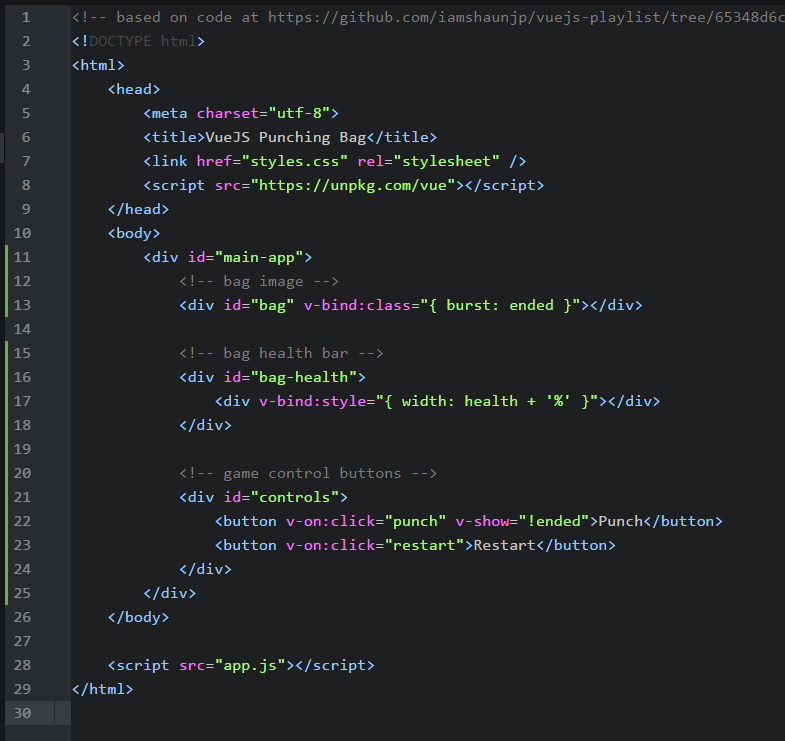

# CS52 Workshop, 5/15/18:  Vue.js


Vue.js is, quite simply, a framework for building user interfaces. Does that sound familiar?
It should, because that's the same thing that React does! In fact, you'll see Vue.js commonly
listed as an alternative to React or Angular. It's lightweight, fast, and
features components like React. Unlike React, Vue.js allows two way data binding
between your Javascript and the DOM.

## Overview

In this tutorial, we'll build a single page app that demonstrates the basic functionality
of Vue.js. We'll create a virtual punching bag!


## Setup

Because this is a demo of Vue itself, there is no need to set up anything else
beyond these project files on your computer.

Let's install vue:

~~~~
$ npm install vue
~~~~

## Step by Step

* Explanations of the what **and** the why behind each step. Try to include:
  * higher level concepts
  * best practices

Remember to explain any notation you are using.

To get started, add the following HTML inside the body tags of `index.html`.
This provides a place for your Vue component to be mounted and provides some controls.

```html
<div id="main-app">
    <!-- bag image -->
    <div id="bag" v-bind:class="{ burst: ended }"></div>

    <!-- bag health bar -->
    <div id="bag-health">
        <div v-bind:style="{ width: health + '%' }"></div>
    </div>

    <!-- game control buttons -->
    <div id="controls">
        <button v-on:click="punch" v-show="!ended">Punch</button>
        <button v-on:click="restart">Restart</button>
    </div>
</div>
```
Your index.html should look like this:

<!--  -->

So far this is all pretty familiar, right? :sleeping:
Don't worry, we're getting to the good stuff soon.
<!-- :sunglasses: GitHub markdown files [support emoji notation](http://www.emoji-cheat-sheet.com/) -->

<!-- Here's a resource for [github markdown](https://guides.github.com/features/mastering-markdown/). -->


## Summary / What you Learned

* [ ] can be checkboxes

## Resources

This workshop was based on a tutorial at https://www.youtube.com/watch?v=WjfpQlVem-8.
The repo with their provided code is located at https://github.com/iamshaunjp/vuejs-playlist/tree/65348d6c9202c7f573ca62305ca8c8cf19f15d58.
