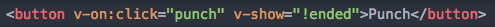

# CS52 Workshop, 5/15/18:  Vue.js


Vue.js is, quite simply, a framework for building user interfaces. Does that sound familiar?
It should, because that's the same thing that React does! In fact, you'll see Vue.js commonly
listed as an alternative to React or Angular. It's lightweight, fast, and
features components like React. Unlike React, Vue.js allows two way data binding
between your Javascript and the DOM.

## Overview

In this tutorial, we'll build a single page app that demonstrates the basic functionality
of Vue.js. We'll create a virtual punching bag!


## Setup

Because this is a demo of Vue itself, there is no need to set up anything else
beyond these project files on your computer.

Let's install vue:

~~~~
$ npm install vue
~~~~

## Step by Step

* Explanations of the what **and** the why behind each step. Try to include:
  * higher level concepts
  * best practices

Remember to explain any notation you are using.

To get started, add the following HTML inside the body tags of `index.html`.
This provides a place for your Vue component to be mounted and provides some controls, to which we will bind functionality.

```html
<div id="main-app">
    <!-- bag image -->
    <div id="bag"></div>

    <!-- bag health bar -->
    <div id="bag-health"></div>

    <!-- game control buttons -->
    <div id="controls">
        <button>Punch</button>
        <button>Restart</button>
    </div>
</div>
```

Your index.html should look like this:


Now head over to your app.js file. You'll notice the line ``el='#main-app'``.
``el`` is an element selector, and it specifies the div that our app is going to act on (the same way we used ``getElementById`` in previous labs).

In your app.js, inside the ``data`` section , paste the following code:

~~~~
health: 100,
ended: false,
~~~~

These variables act like states, and they can be manipulated by the functions we provide in the methods section.
In this case, they keep track of the health of our bag and boolean indicating if the game has ended.

Now let's add a few methods to make our game more interesting. Paste the following code inside methods:

~~~~
punch() {
      this.health -= 10;
      if (this.health <= 0) {
        this.ended = true;
      }
    },
    restart() {
      this.health = 100;
      this.ended = false;
    },
~~~~

We can set on click methods on our controls to call these functions.
Add `v-on:click="punch"` to the Punch button in game controls in your ``index.html`` file. Connect the restart function similarly.

We also only want to show the Punch button while the game is in play, and we can do this with the `v-show` property, by binding it to the boolean `ended`. Add `v-show="!ended"` to the Punch button as well. Your Punch button should now look like:


If you want to test what you've made so far, go ahead and run `python -m SimpleHTTPServer 9000` as usual.

Now we can show a health bar and decrease it as we punch the bag. Add `<div v-bind:style="{ width: health + '%' }"></div>` inside the div with id="bag=health". How does this work? We've just bound `health` from inside data to the width property, converted to a string by concatenation with '%'.

We can bind not only data but classes to our elements. Change your bag image div to: `<div id="bag" v-bind:class="{ burst: ended }"></div>`. We are applying the burst class, which has a different punching bag image, when the boolean `ended` is true. (Remember that SimpleHTTPServer doesn't support hot reloading if you can't see these changes.)

And we're done!


## Summary / What you Learned

* [x] how to create a Vue app with methods and state
* [x] use booleans to hide/show elements
* [x] bind data or classes to elements
* [x] set on click listeners

## Extra Credit

* [ ] 

## Resources

This workshop was based on a tutorial at https://www.youtube.com/watch?v=WjfpQlVem-8.
The repo with their provided code is located at https://github.com/iamshaunjp/vuejs-playlist/tree/65348d6c9202c7f573ca62305ca8c8cf19f15d58.
